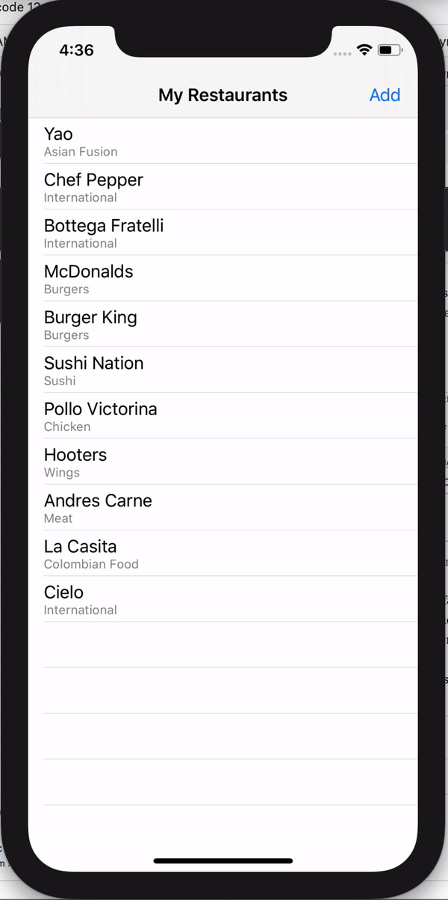
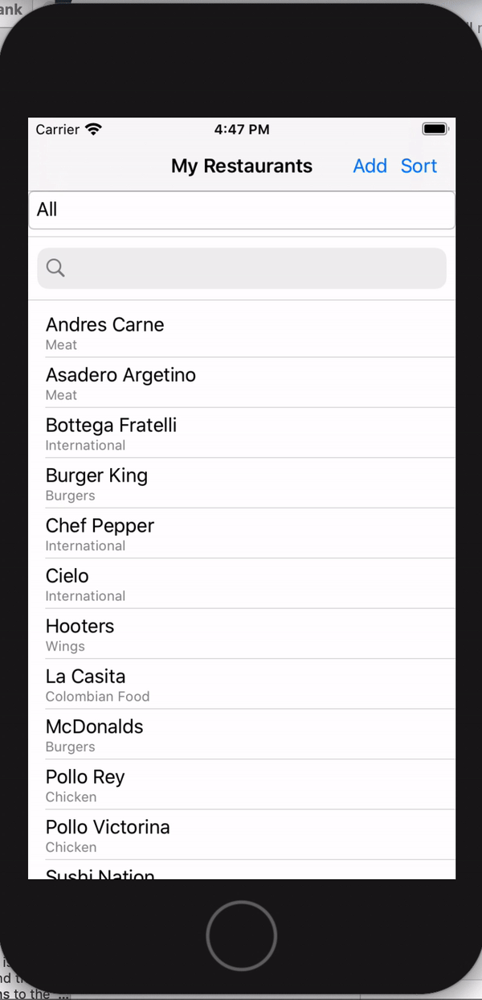
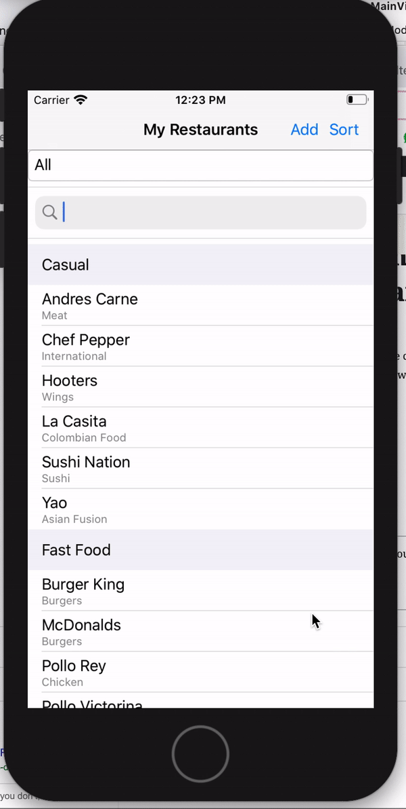

# DynamicData Sample

This is the Sample of the serie about about DynamicData. 

This coverts: 
- Simple List of Restaurants
- Add
- Delete
- Filter 
- Sort 
- Grouping

Add/Delete

Check the full article here[https://www.xamboy.com/2021/01/20/using-dynamic-data-in-xamarin-forms-part-1/].

Filter/Sort

Check the full article here[https://www.xamboy.com/2021/01/25/filtering-and-sorting-with-dynamic-data-in-xamarin-forms-part-2/].

Gruping

Check the full article here[https://www.xamboy.com/2021/02/10/grouping-with-dynamic-data-in-xamarin-forms-part-3/].

